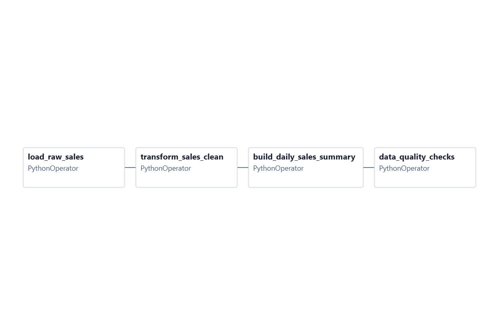
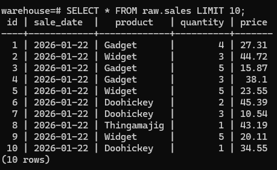
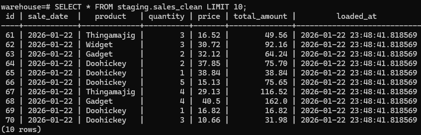
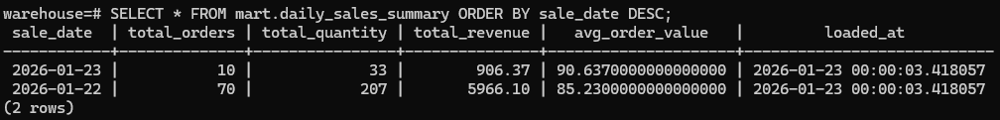
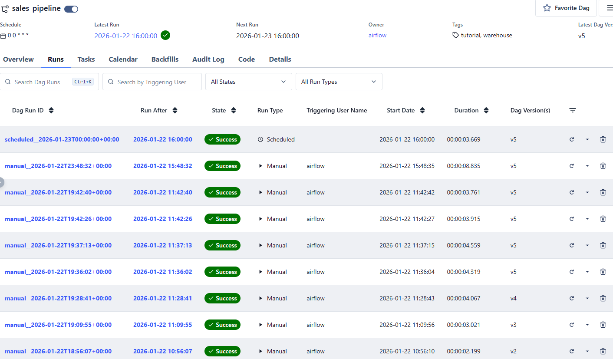

# airflow-sales-pipeline

An end-to-end ETL data pipeline built with Apache Airflow and PostgreSQL.

This project demonstrates how to orchestrate a multi-layer data warehouse pipeline including:
- Raw ingestion
- Staging transformations
- Analytics-ready mart tables
- Automated data quality checks
- Incremental daily loads

---

## 🏗 Architecture

**Pipeline Flow:**

raw.sales → staging.sales_clean → mart.daily_sales_summary → data_quality_checks



---

## 🧩 Technologies Used

- Apache Airflow
- PostgreSQL
- Docker & Docker Compose
- Python
- SQL

---

## 🔄 DAG Overview

This DAG runs daily and performs the following steps:

1. **load_raw_sales**  
   Loads 10 new sales rows per day into the raw layer (idempotent daily load)

2. **transform_sales_clean**  
   Cleans and transforms raw data into staging  
   - Normalizes product names  
   - Adds total_amount column  
   - Ensures re-runnable upserts  

3. **build_daily_sales_summary**  
   Aggregates daily metrics into a mart table  
   - Total orders  
   - Total quantity  
   - Total revenue  
   - Average order value  

4. **data_quality_checks**  
   Validates pipeline health  
   - Row counts  
   - Missing data  
   - Invalid values  


---

## 📊 Data Layers

### Raw Layer

CREATE SCHEMA IF NOT EXISTS raw;

CREATE TABLE IF NOT EXISTS raw.sales (
    id SERIAL PRIMARY KEY,
    sale_date DATE NOT NULL,
    product TEXT NOT NULL,
    quantity INT NOT NULL,
    price NUMERIC NOT NULL
);

### Purpose: Stores incoming transactional sales data exactly as received (no transformations yet).



---

## Staging Layer

### Staging Layer (Cleaned + Enriched)
CREATE SCHEMA IF NOT EXISTS staging;

CREATE TABLE IF NOT EXISTS staging.sales_clean (
    id INT PRIMARY KEY,
    sale_date DATE NOT NULL,
    product TEXT NOT NULL,
    quantity INT NOT NULL,
    price NUMERIC NOT NULL,
    total_amount NUMERIC NOT NULL,
    loaded_at TIMESTAMP NOT NULL DEFAULT NOW()
);

### Upsert from Raw → Staging

INSERT INTO staging.sales_clean (id, sale_date, product, quantity, price, total_amount)
SELECT
    s.id,
    s.sale_date,
    INITCAP(TRIM(s.product)) AS product,
    s.quantity,
    s.price,
    (s.quantity * s.price) AS total_amount
FROM raw.sales s
ON CONFLICT (id) DO UPDATE SET
    sale_date = EXCLUDED.sale_date,
    product = EXCLUDED.product,
    quantity = EXCLUDED.quantity,
    price = EXCLUDED.price,
    total_amount = EXCLUDED.total_amount,
    loaded_at = NOW();

### Purpose:

Standardizes product names

Adds a calculated column (total_amount)

Keeps pipeline idempotent using ON CONFLICT    


---

### Mart Layer

### Mart Layer (Aggregated Reporting Table)

CREATE SCHEMA IF NOT EXISTS mart;

CREATE TABLE IF NOT EXISTS mart.daily_sales_summary (
    sale_date DATE PRIMARY KEY,
    total_orders INT NOT NULL,
    total_quantity INT NOT NULL,
    total_revenue NUMERIC NOT NULL,
    avg_order_value NUMERIC NOT NULL,
    loaded_at TIMESTAMP NOT NULL DEFAULT NOW()
);

### Upsert Daily Aggregates

INSERT INTO mart.daily_sales_summary (
    sale_date, total_orders, total_quantity, total_revenue, avg_order_value
)
SELECT
    sale_date,
    COUNT(*) AS total_orders,
    SUM(quantity) AS total_quantity,
    SUM(total_amount) AS total_revenue,
    CASE
        WHEN COUNT(*) = 0 THEN 0
        ELSE SUM(total_amount) / COUNT(*)
    END AS avg_order_value
FROM staging.sales_clean
GROUP BY sale_date
ON CONFLICT (sale_date) DO UPDATE SET
    total_orders = EXCLUDED.total_orders,
    total_quantity = EXCLUDED.total_quantity,
    total_revenue = EXCLUDED.total_revenue,
    avg_order_value = EXCLUDED.avg_order_value,
    loaded_at = NOW();



---



---

## 🚀 How to Run Locally

```bash
docker compose up -d

Access Airflow UI at:

http://localhost:8080

Default login:

Username: airflow
Password: airflow

### ✅ Data Quality Checks/Queries to Run

-- Raw row count check
SELECT COUNT(*) FROM raw.sales;

-- Staging row count check
SELECT COUNT(*) FROM staging.sales_clean;

-- Mart row existence check for today
SELECT COUNT(*)
FROM mart.daily_sales_summary
WHERE sale_date = CURRENT_DATE;

-- Invalid raw data
SELECT COUNT(*)
FROM raw.sales
WHERE quantity <= 0 OR price <= 0;

-- Invalid staging data
SELECT COUNT(*)
FROM staging.sales_clean
WHERE quantity <= 0
   OR price <= 0
   OR total_amount <= 0;
